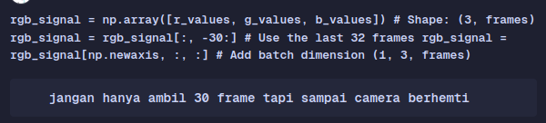
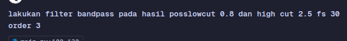
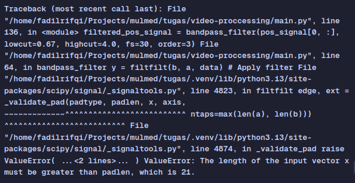
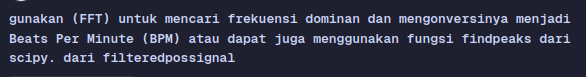

## Laporan

Tugas video proccesing ini harus bisa mendeteksi bpm dari video, untuk mencapai itu kita harus bisa mengcapture kulit dari seseorang karena dari kulit terlihat aliran darah yang mengalir sehingga kita bisa tahu detak jantung seseorang.

Tugas ini menggunakan library dlib dengan model bawaan get_frontal_face_detector untuk mendeteksi muka, kemudian menggunakan shape predictor shape_predictor_68_face_landmarks.dat untuk menampilkan landmark wajah, kemudian saya ambil sinyal rgb yang ada di pipi kiri dan melakukan ekstraksi sinyal menggunakan metode POS, kemudian dilakukan bendpass dari 0.67 - 4.0 hz untuk memfilter bpm manusia dari 40 - 240

## Perbedaan

Yang berbeda dari yang saya kerjakan dari demo yang dilakukan di kelas meliputi, saya mempersempit roi hanya menjadi cakupan pipi kiri saja, memvisualkan signal rgb dan hasil filter POS

## Lampiran Penggunaan AI

       
